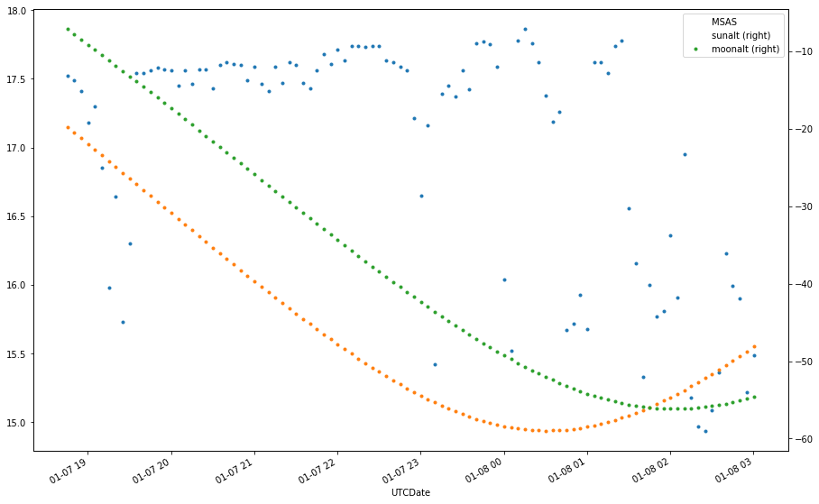

# Light-Pollution

`observations` is a python module for dealing with skyglow observation files. 
The standard is described at https://www.darksky.org/wp-content/uploads/bsk-pdf-manager/47_SKYGLOW_DEFINITIONS.PDF.
At the moment this module deals with SQM data. Specifically it takes the observation file, extracts the location and times and can then produce new observation files for:
* when the sun and moon are below a certain altitude
* from 2300 to 0100 local time when the sun and moon are below a certain altitude

## Installation and usage
You'll need `pandas` and `ephem` installed to use this.

On windows I'd suggest using [anaconda](www.anaconda.com). On unix-likes, `pip install pandas ephem`

Copy the observations.py file and include it or run the sqm.py command

## Command line
```python
$ sqm.py  -h
usage: sqm.py [-h] -i INFILE (-d | -t) [-m MINMOON] [-s MINSUN] [-o OUTFILE]

SQM datafile processing.

optional arguments:
  -h, --help            show this help message and exit
  -i INFILE             Input logfile
  -d                    output only the rows where the Sun is below minsun and
                        the Moon below minmoon
  -t                    output only the rows an hour either side of the solar
                        midnight (the solar antitransit time for that night)
  -m MINMOON, --minmoon MINMOON
                        Minimum altitude of the Moon in degress relaive to the
                        horizon to consider for --dark. (Default: -10)
  -s MINSUN, --minsun MINSUN
                        Minimum altitude of the Sun in degress relaive to the
                        horizon to consider for --dark. (Default: -18)
  -o OUTFILE, --outfile OUTFILE
                        File to write output to. (Default: stdout).
```

## As a module

```python
include observations
```
### Reading an observation file
```python
SQM = observations.Datafile()
SQM.read("20190227_155001_.dat")
```
### Computing the sun and moon altitude for each row
```python
SQM = observations.Datafile()
SQM.read("20190227_155001_.dat")
SQM.compute()
```
### Reducing the data

To get just the rows when the Sun is below -18 degrees and the Moon is below -7 degrees 
and write that to a new file we can do:
````python
SQM.reduce_dark(sunlow=-18, moonlow=-10)
SQM.write("sunmoonset.dat")
````
This will also add a comment in the header listing the 5% and 95% percentile SQM readings

To further get the data an hour either side of local midnight as this is a relatively stable portion 
of the night we can do:
```python
SQM.reduce_midnight()
SQM.write("midnight.dat")
```

What this is actually doing is computing the solar antitransit time for that night 
(pyemphem: `ephem.Observer().next_antitransit(ephem.Sun()).datetime()`) 
and using that as the midnight value. So this will vary over the year.

## Additional usage
compute(), reduce_midnight() and reduce_dark() return pandas DataFrames. 

This allows you to pandas type things like say plot the SQM reading with sun and moon altitude:
```python
import matplotlib.pyplot as plt

SQM.compute()
df = SQM.reduce_dark(sunlow=-18, moonlow=-10)
plt.figure()
df2 = df.set_index('UTCDate')[:100]
fig, ax = plt.subplots()
df2[['MSAS']].plot(ax=ax,style=".")
df2[['sunalt']].plot(ax=ax,style=".", secondary_y=True)
df2[['moonalt']].plot(ax=ax,style=".", secondary_y=True)
```



